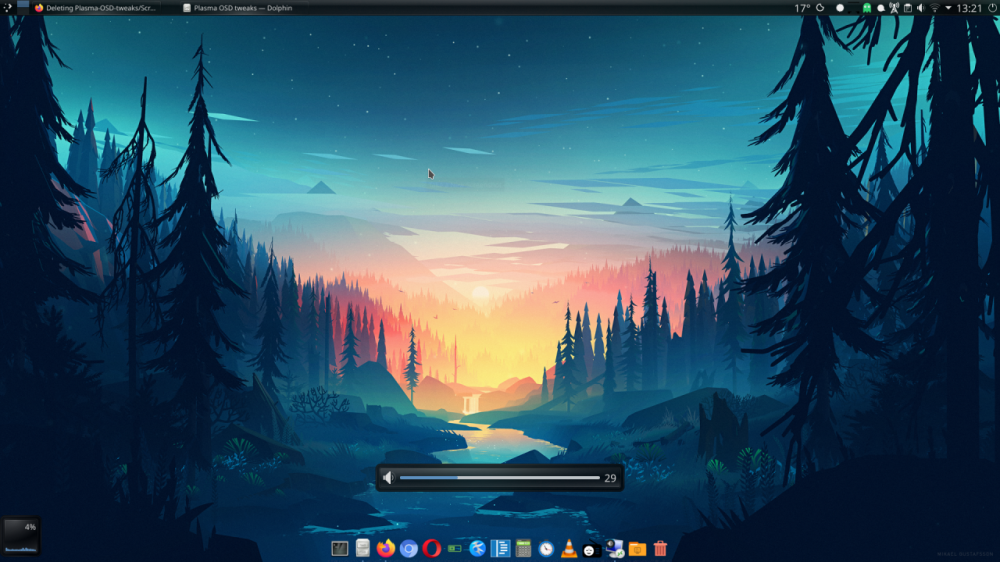

# Plasma-OSD-tweaks

Change size, style and postion of plasma on screen display for volume

Osd.qml changes position of the volume OSD dialog. Only use this to push OSD down to the bottom of the screen (see sreenshot)

OsdItem changes the shape and style of the volume OSD dialog

Screenshot:

